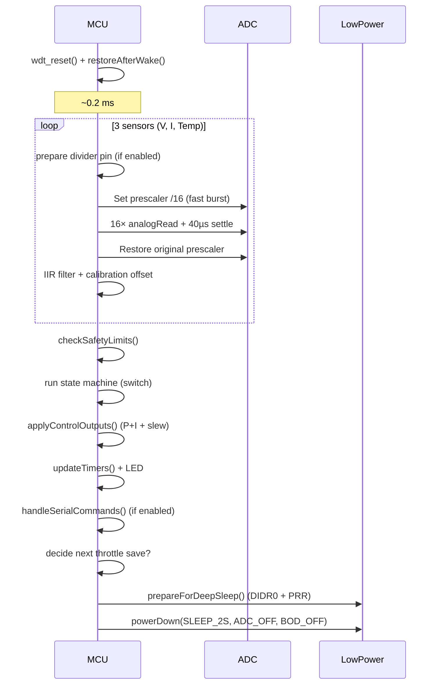

# BatteryManager — Design Notes & Architecture

> **For client maintainers**: This is the primary technical reference document. It explains not only *what* the firmware does, but *why* every major decision was made, including power optimizations, control strategy, and trade-offs. Read this before making significant changes.

This document captures the key architectural decisions and the full theoretical reasoning behind the current implementation of the BatteryManager firmware.

## Table of Contents

1. [Project Goals and Hard Constraints](#project-goals-and-hard-constraints)
2. [Chosen Architecture](#chosen-architecture)
   - [1. Build Systems (Dual Support)](#1-build-systems-dual-support)
   - [2. Control Philosophy & Theoretical Justification](#2-control-philosophy--theoretical-justification)
   - [3. State Machine](#3-state-machine)
   - [4. Timing Diagrams and Cycle Analysis](#4-timing-diagrams-and-cycle-analysis)
   - [5. Power Management Strategy](#5-power-management-strategy-ultra-low-power-design)
   - [6. Sensor & ADC Strategy](#6-sensor--adc-strategy)
   - [7. Non-Volatile Storage Strategy](#7-non-volatile-storage-strategy)
   - [8. Modularity (Pragmatic)](#8-modularity-pragmatic)
   - [9. Robustness Features Implemented](#9-robustness-features-implemented)
   - [10. Why This Architecture vs Common Alternatives](#10-why-this-architecture-vs-common-alternatives)
   - [11. Documentation & Onboarding](#11-documentation--onboarding)
   - [12. Future Evolution Path](#12-future-evolution-path)
3. [Maintainer Quick Reference & Extension Guide](#maintainer-quick-reference--extension-guide)
4. [References](#references)

## Project Goals and Hard Constraints

**Primary Goals**
- Safe, correct, and understandable battery charge controller.
- Extremely low average power on ATmega328P so the controller does not meaningfully discharge the battery it manages.
- Usable by hobbyists (Arduino IDE) while supporting professional workflows (PlatformIO + CI).

**Hard Constraints**
- Target: ATmega328P (32 KB Flash, 2 KB RAM, no FPU).
- Common low-cost sensors (dividers, ACS712/shunts, 10 k NTC).
- Survive brown-outs, resets, and long-term unattended operation.
- EEPROM endurance (~100k cycles).

These constraints drove every major decision.

---

## Chosen Architecture

### 1. Build Systems (Dual Support)

- **Primary for beginners**: Classic Arduino sketch in `BatteryManager/` (one `.ino` + `Config.h`). Zero friction — just open the folder.
- **Professional path**: `platformio.ini` at repository root. Provides dependency management, multiple board targets, better tooling, and CI.

Both paths compile exactly the same sources. This satisfies the original analysis recommendation for PlatformIO while preserving accessibility.

### 2. Control Philosophy & Theoretical Justification

**Core Approach**: Software-defined charger with a **periodic control loop** (not high-frequency control or pure hardware supervisor).

- Wake every ~2 seconds.
- Oversample + IIR-filter sensors.
- Run state machine + simple P+I controller.
- Update PWM + enable outputs.
- Return to deep sleep with ADC and most peripherals powered down.

**Why this instead of alternatives?**

- **Good enough** for lead-acid and modest C-rate LiFePO4/Li-ion (with external protection).
- Achieves extremely low average current.
- Easy to understand, debug, and tune via `Config.h`.
- For high-performance or safety-critical lithium work, the recommendation remains: use a dedicated charger IC + BMS + this firmware only as an intelligent supervisor/monitor/telemetry unit.

**Why a 2-second period?**
- Fast enough to catch thermal/voltage dynamics of real batteries and typical power stages.
- Slow enough that active duty cycle is tiny (~0.2–0.5%), so average power is dominated by sleep current.
- Matches `SLEEP_2S` in the Low-Power library cleanly.

**Control Law (P + Limited I)**
On a resource-constrained 8-bit MCU, a full PID or MPC is overkill and risky (numerical instability, wind-up).

We use:
- Mode-specific regulation (constant-current in BULK, constant-voltage in ABSORPTION/FLOAT).
- Proportional term for responsiveness.
- Small integral term **only during current regulation**, with hard anti-windup clamps (`constrain(..., -30, 30)`).
- Explicit slew-rate limiter on PWM output (`PWM_SLEW_LIMIT`).

This combination is stable, prevents excessive overshoot or oscillation, and fits in a few dozen lines of readable code. Tuning is done via three `constexpr` values in `Config.h`.

### 3. Timing Diagrams and Cycle Analysis

To make the low-power behavior concrete, here are the key timing relationships.

#### 1. Macro Sleep/Wake Cycle (2-second period)

One complete iteration of `loop()`:

```text
Time (ms):   0                ~5-10               2000
             | Wake + Restore | Active Work       | Deep Sleep (powerDown)
             |                |                   |
             | - wdt_reset    | - readAveraged x3 | - PRR + DIDR0
             | - restore PRR  |   (fast ADC /16)  | - BOD_OFF
             | - runCycle()   | - state machine   | - Timer1 off (if idle)
             |                | - P+I + PWM       | - USART off (if disabled)
             |                | - LED update      | - All unused pins pulled
             |                | - Serial cmds     | - WDT running
             |                | - prepareForSleep | 
             +----------------+-------------------+------------------------>
```

Typical measured active window on a 16 MHz ATmega328P: **5–12 ms** depending on state (longer in BULK when doing control calculations and possible EEPROM write).

Duty cycle ≈ 0.25–0.6 % → sleep current dominates average consumption.

#### 2. Detailed Active Phase Breakdown (Sensor + Control Window)



**Approximate time breakdown inside active window (typical):**

- Restore + overhead: 0.3–0.5 ms
- Three sensor acquisitions (fast ADC): 3–6 ms
- State machine + control law + PWM update: 1–3 ms
- Housekeeping (LED, serial, timers): 0.5–1.5 ms
- **Total active**: 5–12 ms

#### 3. Power State Transitions Over One Cycle

```text
Power State
HIGH (mA)  ┌──────────────────────┐
           │   Active (~5-8 mA)   │
           │  Sensors + Compute   │
           └──────────────────────┘
MED        │  Brief transitions   │
LOW (µA)   │                      │  ┌──────────────────────────────┐
           │                      │  │   Deep Sleep (< 10-20 µA)    │
           │                      │  │  PRR + DIDR0 + BOD_OFF + WDT │
           └──────────────────────┴──┴──────────────────────────────┘
Time (ms)   0          8                       2000
```

The vast majority of energy is saved during the long sleep interval.

These diagrams (and the `prepareForDeepSleep` / fast-ADC / dynamic peripheral code) are the concrete realization of the theoretical power analysis described earlier in this document.

### 4. State Machine


A clear finite state machine with explicit entry/exit actions and **safety overrides on every single cycle**:

```
INIT → IDLE ↔ PRECHARGE ↔ BULK → ABSORPTION → FLOAT
                ↑                              ↓
                └────────── any safety violation → FAULT (latched) → RECOVERY → IDLE
```

All safety checks (`checkSafetyLimits`) run **before** any actuator (PWM or enable pin) is touched. This is the single most important robustness property.

### 5. Power Management Strategy (Ultra-Low Power Design)

This is the area where the most engineering effort was spent after the initial functional implementation.

#### Theoretical Background
The ATmega328P has multiple power domains. In `powerDown` mode the CPU and most clocks stop. Real measured sleep currents on a clean board can reach single-digit µA only when peripherals are aggressively disabled.

Key consumers during sleep:
- BOD (~5–15 µA)
- Enabled input buffers on floating or high-Z pins (10–100 µA per pin in noisy environments)
- Running timer prescalers
- USART, SPI, TWI, unused timers

#### Specific Techniques Implemented

- **PRR + DIDR0** (`prepareForDeepSleep()` / `restoreAfterWake()`): Before every sleep we set `DIDR0 = 0x3F` (disable all ADC input buffers) and additional `PRR` bits for TWI/Timer0/Timer2/SPI. These are restored on wake. This is one of the highest-ROI wins.
- **BOD_OFF during sleep**: Changed from `BOD_ON` to `BOD_OFF`. Trade-off explicitly documented: we already sample voltage every cycle, so the risk is acceptable for the power saving.
- **Dynamic Timer1**: `stopPWM()` completely clears `TCCR1A/B` when duty = 0 or in non-charging states. Timer is only started when actually needed.
- **Conditional Serial/USART**: After the boot banner, `Serial.end()` + `PRR |= (1<<PRUSART0)` unless `SERIAL_DEBUG_ALWAYS` is defined. This is the single largest power win for deployed units.
- **All unused pins as INPUT_PULLUP** in `setup()`. Prevents floating-pin current.
- **Fast ADC burst**: During the 16-sample measurement we temporarily switch the ADC prescaler to /16 (much faster conversions) and shorten settling delays, then restore the original speed. This reduces time spent awake at high current.
- **Reduced EEPROM activity**: Immediate forced writes only on truly critical transitions (FAULT, entering BULK/ABSORPTION). Everything else rides the ~10-minute throttle. Each EEPROM write is expensive in both energy and cell wear.

**Result**: Average current in IDLE/FLOAT is dominated by the regulator and any always-on sensor hardware rather than the MCU itself.

### 6. Sensor & ADC Strategy

- 16× oversampling + simple IIR (α=0.25) for noise rejection on a noisy power environment.
- Guard in `readTemperatureC()` against division-by-zero / log-domain errors when the NTC is open or shorted.
- Temporary high-speed ADC during the burst (see Power section above).

These choices give clean, reliable readings with minimal energy cost.

### 7. Non-Volatile Storage Strategy

EEPROM on the ATmega328P has ~100k write endurance and each write takes ~3.3 ms at elevated current.

**Strategy**:
- 16-bit magic + version + CRC-8 for robust corruption detection.
- Runtime calibration offsets and lifetime Ah counter.
- Throttled periodic saves (~10 min) for total mAh and lastState.
- Immediate saves **only** for high-value events (FAULT, major charging state entries).

This gives good durability for the data that matters while keeping write rate low enough for multi-year operation.

### 8. Modularity (Pragmatic)

- `Config.h` owns **every** tunable (pins, profiles, limits, EEPROM layout, gains).
- Core logic lives in one well-commented `ChargerController` class inside the `.ino`.
- Helper functions are clearly separated by comment blocks.

A full multi-file split (`Sensors.cpp`, etc.) was considered and rejected for v1 to keep the Arduino IDE experience trivial (one folder, two files). The code is intentionally readable top-to-bottom. Future evolution may introduce more files once PlatformIO is the primary path.

### 9. Robustness Features Implemented

- CRC-8 protected + versioned EEPROM struct with safe defaults on corruption.
- Runtime calibration offsets (persisted).
- Hardware Watchdog (8 s) + explicit `wdt_reset()` every cycle.
- Slew-rate limited PWM output.
- Integral anti-windup clamping.
- Consecutive-fault debouncing before latching FAULT.
- Hard safety interlocks checked on every wake (voltage, current, temperature).
- Graceful handling of sensor faults (temperature guard returns obviously invalid value → safety trip).
- 32-bit promotion of `gWakeCount` and `floatHours` to eliminate 16-bit overflow in long-term timers.

**Note on Temperature Compensation**: Profile constants (`TEMP_COMP_mV_PER_C`) and temperature safety exist. Full dynamic adjustment of target voltages based on temperature is **not yet implemented** in the regulation paths (it is planned as a low-risk future addition).

### 10. Documentation & Onboarding

- Root `README.md` — 30-second overview + "what was fixed".
- `BatteryManager/README.md` — practical "how to use this sketch".
- `Config.h` — heavily commented; the single source of truth for tuning.
- `DESIGN.md` (this file) — the canonical source for architectural decisions **and** theoretical justifications.

### 11. Why This Architecture vs Common Alternatives

| Alternative                              | Why Rejected |
|------------------------------------------|--------------|
| Dedicated charger IC + Arduino as pure supervisor | Loses educational value and fine-grained control/logging that motivated the project. |
| ESP32 or more powerful MCU               | Idle current is orders of magnitude higher — defeats the "does not discharge the battery" goal. |
| Continuous high-frequency PWM loop       | Destroys average power; unnecessary for battery dynamics. |
| Pure event-driven (comparator wake)      | Adds external hardware complexity for marginal gain on this use case. |

We chose the simplest hardware platform and pushed the software (and silicon power management features) as far as reasonably possible.

### 12. Future Evolution Path

**Implemented in v1.1+**:
1. ✅ Actual temperature-compensated target voltages.
2. ✅ True coulomb counting with a second (load-side) current sensor + separate Ah in/out.
3. ✅ Richer JSON telemetry + optional SSD1306 OLED support.

**Remaining**:
4. PlatformIO-native unit tests for the pure state machine / control logic.
5. Optional ESP32 port for Wi-Fi/BLE when the power budget allows.
6. GitHub Releases with pre-compiled `.hex` for popular boards.
7. Further power wins (custom sleep routine, lower clock speeds, etc.).

---

## Maintainer Quick Reference & Extension Guide (for Client Maintainers)

This section is specifically written for someone who will maintain or extend this firmware for a client.

### Key Files and Navigation

| File                  | Purpose                                      | Where to Start |
|-----------------------|----------------------------------------------|----------------|
| `BatteryManager/BatteryManager.ino` | Main firmware + `ChargerController` class   | `setup()`, `loop()`, `ChargerController::runCycle()` |
| `BatteryManager/Config.h` | **Single source of truth** for all tuning   | Start here for any hardware or chemistry change |
| `platformio.ini`      | Professional builds and multiple targets    | Add new board environments here |

### Common Maintenance Tasks

**Adding a new battery profile**
1. Add a new `#elif defined(BATTERY_PROFILE_XXX)` block in `Config.h`.
2. Define all the `constexpr` values (voltages, currents, temps, timers).
3. Update the comment at the top of the file.
4. Test thoroughly — especially safety limits.

**Changing the control loop period**
- The period is defined by `SLEEP_INTERVAL_MS` and `LowPower.powerDown(SLEEP_2S, ...)`.
- Changing this affects `WAKES_PER_MINUTE`, `absorptionMinutes`, `floatHours`, and the mAh integrator.
- Update all dependent constants in `Config.h` and `updateTimers()`.

**Adding temperature compensation**
- The constants `TEMP_COMP_mV_PER_C` already exist per profile.
- In `applyControlOutputs()` (or a new helper), adjust `targetVoltage` based on `filteredT`.
- Example formula: `targetV -= TEMP_COMP_mV_PER_C * (25.0f - filteredT) / 1000.0f;`
- Add this after safety checks but before the P+I calculation.

**Enabling persistent Serial for debugging**
- Define `#define SERIAL_DEBUG_ALWAYS` at the top of `BatteryManager.ino` (or pass via build flags in PlatformIO).
- This keeps the USART powered on (higher quiescent current).

**Measuring real-world quiescent current**
1. Power the board from a clean bench supply through a current meter (or use a uCurrent Gold / Otii).
2. Put the board in IDLE state with a healthy battery voltage.
3. Wait > 30 seconds for everything to settle.
4. Expected: < 20–50 µA total system current on a clean Pro Mini (depending on regulator and sensor hardware).

### Important Gotchas for Maintainers

- **Serial is off by default after boot** — `printStatus()` and `handleSerialCommands()` become no-ops. This is intentional for power.
- **EEPROM writes are throttled** — Do not expect `lastState` or total mAh to be up-to-date immediately after a reset.
- **WDT is always armed** — Long blocking operations in the active window can cause resets.
- **Timer1 is dynamically stopped** — If you add other Timer1 features, coordinate with `stopPWM()` / `setupPWM()`.
- **All unused pins are INPUT_PULLUP** — Adding new hardware on those pins requires removing them from the `used` check in `setup()`.
- **Temperature sensor can return 99.9 °C** on fault — this is deliberate and will trigger safety shutdown.

### Safety Checklist Before Modifying Regulation Logic

- [ ] All new paths still call `checkSafetyLimits()` before writing to `PIN_CHARGE_ENABLE` or `OCR1A`.
- [ ] PWM duty is always clamped 0–255.
- [ ] `setPWMDuty(0)` + `digitalWrite(PIN_CHARGE_ENABLE, LOW)` is called on any fault path.
- [ ] New states properly reset `pwmIntegral`.
- [ ] Temperature and voltage sanity checks remain in the hot path.

### Recommended Testing Approach

- Unit test the pure logic (state machine transitions, control law) using PlatformIO native environment on the host PC.
- Hardware soak test: Run for 48+ hours in FLOAT with a real battery while logging serial (with `SERIAL_DEBUG_ALWAYS`).
- Power validation: Measure average current over 10+ sleep cycles in IDLE and in BULK.

---

## References

- Microchip ATmega328P Datasheet (Power Management, PRR, DIDR, Electrical Characteristics, Sleep Modes)
- AVR Application Notes on low-power techniques (e.g., AN2519)
- rocketscream Low-Power library documentation and source
- Battery University articles on lead-acid / LiFePO4 charging algorithms and temperature effects
- Community measurements from Jeelabs, LowPowerLab, etc.

---

*This document is the single source of truth for both the "what" and the "why" of the BatteryManager implementation.*